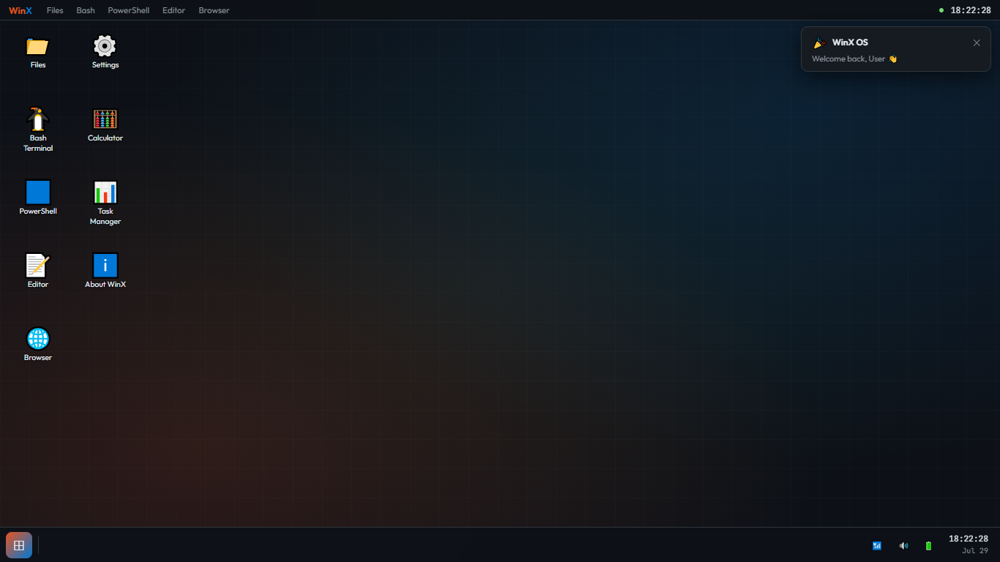
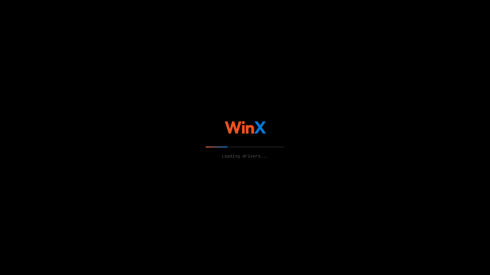
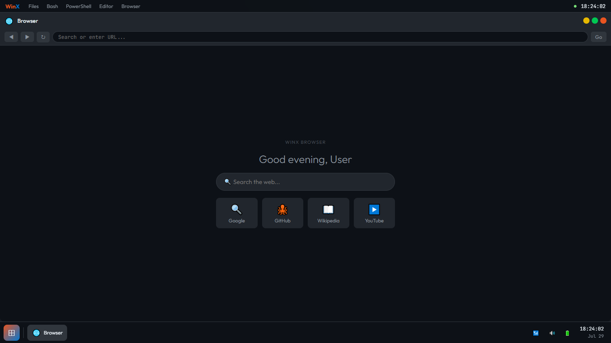
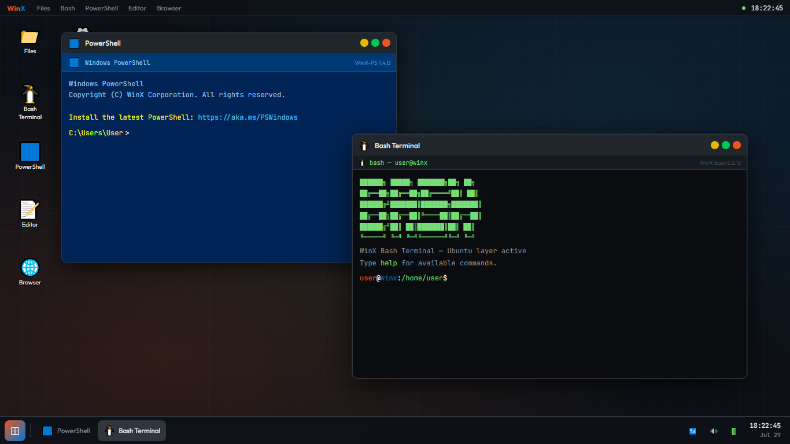
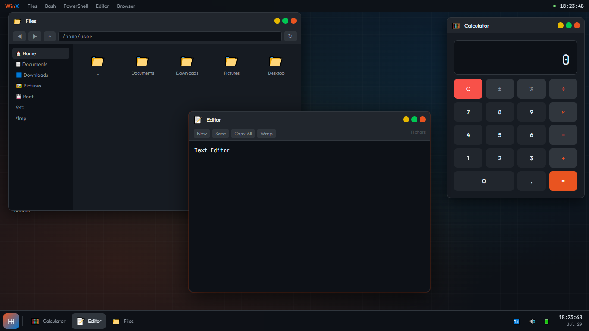

# WinX OS

## About

WinX OS is a web-based operating system concept that combines the familiar interface of Windows with the flexibility and customization of Linux.

This project recreates an OS-like experience using pure HTML, CSS, and JavaScript. It runs directly in a web browser without requiring any installation.

## Features

- 🖥️ Windows-inspired desktop environment
- 🐧 Linux-inspired terminal experience
- 📂 File Explorer simulation
- 📝 Text Editor application
- 🧮 Calculator application
- 🌐 Browser simulation
- 💻 PowerShell & Bash terminal simulation
- 🎨 Custom user interface design

## Screenshots

### Boot Screen

### Desktop Environment

### Browser

### PowerShell & Bash

### File Explorer, Text Editor & Calculator

## Technologies Used

- HTML
- CSS
- JavaScript

## How to Run

1. Download or clone this repository
2. Open `index.html`
3. WinX OS will run directly in your browser

No installation required.

## Project Goals

WinX OS was created as an experiment to create an operating system-like interface using web technologies.

The goal is to combine the simplicity of Windows with the flexibility and customization ideas from Linux.

## Future Improvements

- Add more applications
- Improve animations and transitions
- Add more customization options
- Improve terminal functionality
- Add more Linux-inspired features

## License

This project is licensed under the MIT License.
